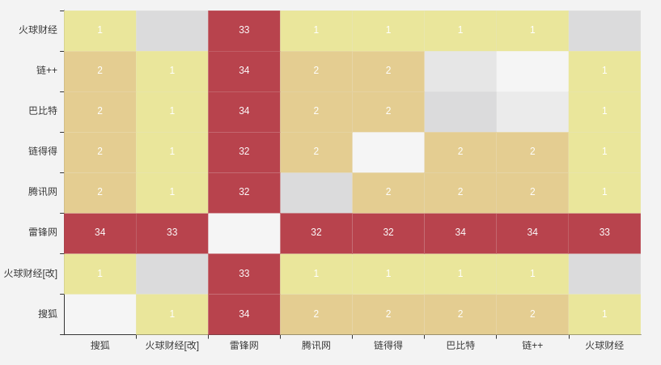

# 媒体相关性分析

对新闻去重是一项复杂任务，传统的去重方法分为两类：
- 规则去重
- 文本相似度去重

## 规则去重

规则去重可以基于url、正文或者文章标题去重，即文章正文一致、标题一致或者url一致的情况下即认为是相同新闻．这种方法可靠性不高，因为大家在对文章进行转发的过程中会不断的修改标题，所以基于标题的方法也不合适．基于正文一致的去重就更加不靠谱了，因为各个编辑往往会把排版进行调整，或者在文章结尾加上不同的落款，比如有的会加载转载免责声明．

所以基于规则的去重能用，但是效果很不好．


## 文本相似度去重

所谓文本相似度即通过一定的算法来计算两段文本之间的相似度，然后根据相似度的分布来确定一个阈值，比如相似度小于某某值的情况下认定两段文本为统一文本．

常用的算法包括：
 - 余弦相似度
 - 曼哈顿距离
 - 欧几里得距离
 - LDA主题建模
 - TF-IDF
 - 编辑距离
 - simhash + 汉明距离
 - 编辑距离

## simhash

这里我们打算使用simhash + 汉明距离来进行文本相似度计算，从而来判断两篇文章是否是同一篇文章．

简单的介绍下simhash的算法原理，simhash是由Moses Charikar提出的，Moses Charikar是一名印度计算机科学家，曾就职于Google，simhash算法也被Google用来进行相似文本的检测．目前Moses Charikar是普林斯顿大学的教授[Wiki](https://en.wikipedia.org/wiki/Moses_Charikar)、[LinkedIn](https://www.linkedin.com/in/moses-charikar-49963945/)．

网上介绍simhash原理的文章很多，我这里简单列几篇，供大家参考：
- [原论文 Similarity estimation techniques from rounding algorithms](https://dl.acm.org/citation.cfm?doid=509907.509965)
- [使用SimHash进行海量文本去重](http://www.cnblogs.com/maybe2030/p/5203186.html)
- [海量数据相似度计算之simhash短文本查找](http://www.lanceyan.com/tech/arch/simhash_hamming_distance_similarity2-html.html)

汉明距离是计算两个simhash对应二进制中取值不一致的值数量，如：

```
bin(1831629298082866460^7965961208256684367).count('1')
```

根据经验，一般汉明距离大于3即可认为是非统一文本．

## 分析过程

### 数据采集

从互联网公开获取了7篇有关＂零知识＂的报道，其中有6篇为各媒体直接的相互转载，1篇为雷锋网刊登的白硕老师的观点，这篇与其余6篇内容不一致，但是主题一致．6篇中有一篇来自火球财经的被进行了段落重置，即将其中的某一个段落与另外一个段落替换了位置．

数据也在存放在了```data/news```下．

#### 读取数据

```
import os
import json

path = 'news/零知识证明：区块链隐私保护利器'

websites = []
contents = []
articles = []
for filename in os.listdir(path):
    print(filename)
    article = json.load(open(os.path.join(path, filename)))
    content = article['content']
    website = article['website']

    websites.append(website)
    contents.append(content)
    articles.append(article)
```

#### 构造文本距离计算函数

因为simhash不能直接对两个字符串进行计算，所以构造一个函数来进行两个字符串的相似度计算．

```
def distance(c1, c2):
    dist = Simhash(c1).distance(Simhash(c2))
    return dist
```

#### 计算各文章之间的两两相似度

```
# 构造一个矩阵
ham_mat = [
    [0 for i in titles] for j in titles
]

# 用于echarts画图
echarts_container =[]

for article_1, article_2 in product(articles, articles):
    dist = distance(article_1['content'], article_2['content'])
    row = websites.index(article_1['website'])
    col = websites.index(article_2['website'])
    print(row, col, titles[row], titles[col], dist)
    ham_mat[row][col] = dist
    echarts_container.append([
        row,
        col,
        dist
    ])

```

分析结果



根据上图，我们不难发现，雷锋网和其他几篇文章的汉明距离都差的比较多，都远远超过3，其他文本之间汉明距离都相差不多，小于3，包括火球财经的那边修改过的文章．


# 脚本使用
```
virtualenv python3.5 py35env
py35env/bin/python -m pip install -r requirements.txt
py35env/bin/python analysis.py
```